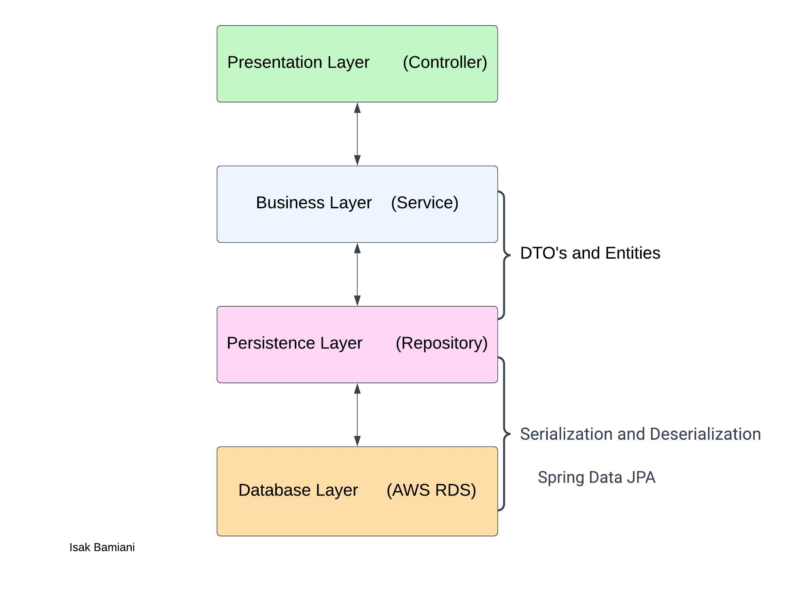

# skuld-search-vessels

An attempt to clone the search functionality and interfcae for searching vessels on the Skuld's website. 

https://www.skuld.com/vessels/

***This design pattern below helps separate concerns and promotes a modular and maintainable codebase;***
 
    
 
    

***Request and Response Flow:*** 
When a client/frontend sends an HTTP request to springboot application(skuld-search-vessels), it hits the corresponding endpoint in the VesselController. The controller's method receives the request, optionally extracts any request parameters or data, and invokes the relevant method(s) in the associated service. The service performs the required business logic, which may include calling the repository to retrieve or modify data in the RDS. The service then returns the result, in the form of a DTO, back to the controller. The controller maps the response to an appropriate HTTP response (e.g., JSON, XML) and sends it back to the client/frontend.
